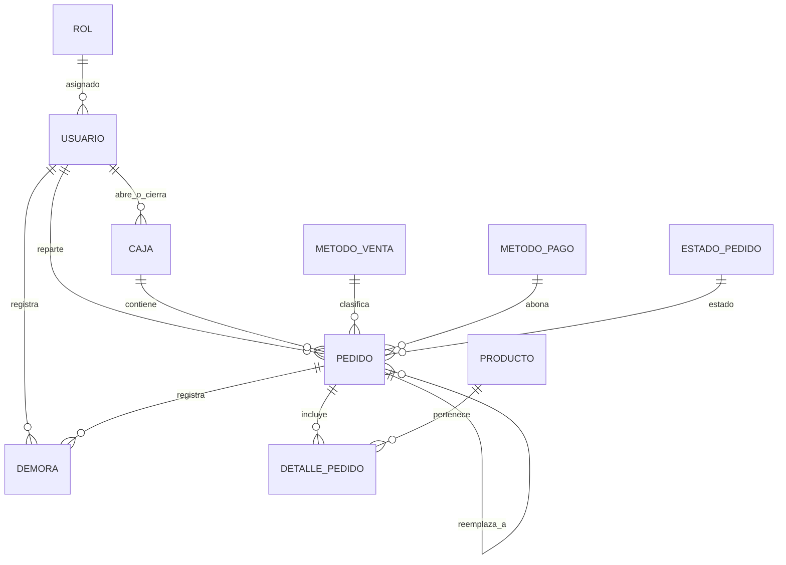

# 🍽️ App Gastronomía — Sistema Integral de Gestión y Logística en Tiempo Real

[](https://dotnet.microsoft.com/)
[](https://www.postgresql.org/)
[](https://developer.android.com/)
[](https://dotnet.microsoft.com/apps/aspnet/signalr)
[](https://maplibre.org/)
[](LICENSE)

Ecosistema monorepo para la administración operativa, gestión de pedidos y logística de delivery en tiempo real para negocios gastronómicos (restaurantes, pizzerías, rotiserías y casas de comida). 

Combina una **API RESTful de alto rendimiento en .NET 10** con WebSockets (SignalR) y una **aplicación móvil Android nativa (Java)** con arquitectura MVVM, geolocalización continua en segundo plano y ruteo dinámico.

---

## 📌 Tabla de Contenidos
- [Arquitectura General](#-arquitectura-general)
- [Módulos y Roles del Sistema](#-módulos-y-roles-del-sistema)
- [Motor de Logística y Ruteo Inteligente](#-motor-de-logística-y-ruteo-inteligente)
- [Tecnologías y Stack Técnico](#-tecnologías-y-stack-técnico)
- [Estructura del Repositorio](#-estructura-del-repositorio)
- [Modelo de Datos y Entidades](#-modelo-de-datos-y-entidades)
- [Seguridad y Políticas de Tráfico](#-seguridad-y-políticas-de-tráfico)
- [Instalación y Configuración](#-instalación-y-configuración)
  - [Requisitos Previos](#requisitos-previos)
  - [Backend (.NET 10 + PostgreSQL)](#backend-net-10--postgresql)
  - [Mobile (Android)](#mobile-android)
- [Eventos en Tiempo Real (SignalR Hub)](#-eventos-en-tiempo-real-signalr-hub)
- [Testing y Calidad de Código](#-testing-y-calidad-de-código)

---

## 🏗️ Arquitectura General

El proyecto está diseñado bajo los principios de **Clean Architecture** en el Backend y **MVVM (Model-View-ViewModel)** en Android, comunicados mediante HTTP/JSON y canales bidireccionales WebSocket.

```
                    ┌──────────────────────────────────────────────┐
                    │               Android Mobile App             │
                    │   (Cajero / Cocina / Repartidor / Admin)     │
                    └───────────────┬──────────────┬───────────────┘
                                    │              │
                   HTTPS / REST API │              │ WebSockets (SignalR)
                                    ▼              ▼
                    ┌──────────────────────────────────────────────┐
                    │            ASP.NET Core Web API 10           │
                    │  ┌────────────────────────────────────────┐  │
                    │  │ Controllers & JWT Auth Gate & Limiter  │  │
                    │  ├────────────────────────────────────────┤  │
                    │  │ Services Layer (Business Logic & Hubs) │  │
                    │  ├────────────────────────────────────────┤  │
                    │  │ Infrastructure (EF Core 10 + Npgsql)   │  │
                    │  └────────────────────────────────────────┘  │
                    └───────────────┬──────────────┬───────────────┘
                                    │              │
                                    ▼              ▼
                        ┌──────────────┐        ┌──────────────────┐
                        │  PostgreSQL  │        │   OSRM Routing   │
                        │   Database   │        │   (Geo Engine)   │
                        └──────────────┘        └──────────────────┘
```

---

## 👥 Módulos y Roles del Sistema

El sistema implementa control de acceso basado en roles (**RBAC**):

### 1. 💼 Módulo Cajero / Administrador
- **Gestión Integral de Cajas**: Apertura y cierre de turnos con arqueo ciego/teórico vs. real, detección de diferencias y consulta de historial detallado de pedidos por sesión de caja.
- **Toma de Pedidos Multicanal**: Creación rápida de comandas para **Salón / Mesa**, **Mostrador / Retiro** y **Delivery**.
- **Gestión de Catálogo**: Altas, bajas, modificaciones de productos con precio y tiempo base de elaboración en máquina/cocina.
- **Monitoreo en Tiempo Real de Repartidores**: Mapa interactivo con la ubicación GPS en vivo de todos los repartidores activos y la cantidad de pedidos asignados.
- **Gestión de Contingencias y Reintentos**: Cancelación justificada de envíos fallidos y reenvío automático de la comanda a cocina con trazabilidad del pedido original (`PedidoOrigenId`).
- **Configuración de Negocio**: Coordenadas base del local (lat/long de partida), métodos de pago por defecto y tope máximo de pedidos simultáneos por repartidor.

### 2. 👨‍🍳 Módulo Cocina (KDS - Kitchen Display System)
- **Cola de Comandas en Vivo**: Recepción instantánea de nuevos pedidos vía SignalR sin necesidad de refrescar la pantalla.
- **Transición de Estados**: `Pendiente` ➔ `En Preparación` ➔ `Listo para Retirar` / `Listo para Envío`.
- **Gestión de Demoras de Cocina**: Registro de cuellos de botella por sector (ej. horno, freidora) con cálculo automático del impacto en la hora estimada de entrega de los pedidos afectados.

### 3. 🛵 Módulo Repartidor (Delivery & Tracking)
- **Hoja de Ruta y Despacho**: Visualización de pedidos asignados con dirección de entrega y detalle.
- **Geolocalización Continua en Segundo Plano**: `LocationForegroundService` que transmite coordenadas periódicas al servidor mediante WebSocket mientras el repartidor está en ruta.
- **Ruta y Navegación Visual**: Renderizado del trazado de la ruta en mapa vectorial con **MapLibre GL** y cálculo de distancias/tiempos con **OSRM**.
- **Cambio de Estado de Entrega**: Marcado de `En Camino` ➔ `Entregado` o reporte de contingencia/devolución.

---

## 🗺️ Motor de Logística y Ruteo Inteligente

El sistema calcula de forma dinámica y precisa la **Demora Estimada Total** (`DemoraAprox`) y la **Fecha Estimada de Finalización** (`FechaEstimadoFin`):

$$\text{Demora Total} = \max(\text{Demora de Productos}) + \sum(\text{Demoras de Cocina}) + \text{Demora de Traslado OSRM}$$

1. **Demora de Preparación**: Tiempo máximo de elaboración entre los productos que componen el pedido.
2. **Demoras Extraordinarias**: Minutos adicionales reportados por los cocineros o el cajero.
3. **Demora de Delivery**: Tiempo estimado de viaje en automóvil/moto calculado mediante la API de OSRM (*Open Source Routing Machine*) entre las coordenadas del local y la dirección del cliente.
4. **Propagación en Tiempo Real**: Cada recálculo se notifica inmediatamente a través de SignalR a los grupos correspondientes.

---

## 💻 Tecnologías y Stack Técnico

### Backend
| Componente | Tecnología | Descripción |
|---|---|---|
| **Framework** | .NET 10 (C# 13) | ASP.NET Core Web API de alto rendimiento |
| **Persistencia** | Entity Framework Core 10 | ORM con migraciones de código primero |
| **Base de Datos** | PostgreSQL (Npgsql) | Base de datos relacional robusta |
| **Tiempo Real** | ASP.NET Core SignalR | WebSockets con autenticación Bearer |
| **Seguridad** | JWT + BCrypt.Net-Next | Autenticación basada en tokens y hash de contraseñas |
| **Rate Limiting** | ASP.NET RateLimiter | Protección contra abusos (Sliding & Fixed Window) |
| **Documentación** | Scalar + OpenAPI | Explorador interactivo moderno de la API REST |
| **Georuteo** | OSRM Client | Integración con motor de ruteo Open Source |

### Mobile (Android)
| Componente | Tecnología | Descripción |
|---|---|---|
| **Lenguaje** | Java 11 | Código nativo compatible con Android SDK 24 a 35 |
| **Arquitectura** | MVVM + Repository Pattern | Separación limpia de capas de datos, dominio y UI |
| **Inyección de Dependencias**| Google Hilt (Dagger) | Gestión desacoplada del ciclo de vida de componentes |
| **Componentes Jetpack** | Navigation, ViewModel, LiveData, ViewBinding | Arquitectura reactiva y navegación modular |
| **Networking** | Retrofit 2 + OkHttp 3 + Gson | Consumo de endpoints REST con interceptor JWT |
| **Cliente WebSocket** | Microsoft SignalR Java Client | Escucha y emisión de eventos en tiempo real |
| **Mapas y Geo** | MapLibre GL Android SDK | Mapas vectoriales interactivos con soporte MapTiler |
| **Ubicación** | Google Play Services Location | Foreground Service para tracking GPS continuo |
| **Almacenamiento Seguro** | AndroidX Security Crypto | EncryptedSharedPreferences para tokens y sesión |

---

## 📁 Estructura del Repositorio

```
app-gastronomia/
├── backend/
│   ├── Controllers/             # Controladores REST (Auth, Cajas, Pedidos, Productos, etc.)
│   ├── Domain/
│   │   ├── DTOs/                # Data Transfer Objects y mensajes SignalR
│   │   ├── Entities/            # Entidades de dominio EF Core (Pedido, Caja, Usuario, etc.)
│   │   └── Enums/               # Enums del sistema (EstadoPedidoEnum)
│   ├── Infrastructure/
│   │   └── Data/                # AppDbContext, Seeders iniciales y configuración de datos
│   ├── Migrations/              # Historial de migraciones de EF Core
│   ├── Services/
│   │   ├── Hubs/                # LogisticaHub (SignalR WebSocket)
│   │   ├── Interfaces/          # Contratos de servicios
│   │   ├── Routing/             # Servicio de conexión con OSRM
│   │   └── *.cs                 # Implementaciones de servicios de negocio
│   ├── Tests/                   # Suite de pruebas unitarias, de integración y pipeline
│   ├── appsettings.json         # Configuración del backend
│   └── Program.cs               # Pipeline de ASP.NET Core, DI, Auth y Rate Limiting
│
├── mobile/
│   └── app/src/main/
│       ├── java/.../app_movil_gastronomia/
│       │   ├── core/            # Servicios transversales (SignalR, Location, AuthInterceptor)
│       │   ├── data/            # APIs Retrofit, DTOs y Repositorios
│       │   ├── di/              # Módulos de inyección de dependencias Hilt
│       │   └── ui/              # Fragmentos, ViewModels y Adapters por rol:
│       │       ├── cajero/      # Caja, catálogo, config y mapa de repartidores
│       │       ├── cocina/      # KDS y comandas de cocina
│       │       ├── login/       # Autenticación y navegación por rol
│       │       ├── pedido/      # Creación, detalle y demoras de pedidos
│       │       └── repartidor/  # Rutas, mapa y entrega de pedidos
│       └── res/                 # Layouts (móvil y tablet), temas y navegación
│
└── README.md
```

---

## 🗄️ Modelo de Datos y Entidades



### Entidades Principales
- **`Usuario`**: Cuentas con roles (`Administrador`, `Cajero`, `Cocina`, `Repartidor`), flags de disponibilidad y fuera de servicio.
- **`Caja`**: Registros de turnos con monto de apertura, monto teórico, monto real y usuario responsable.
- **`Pedido`**: Registro maestro de venta con método de pago/venta, coordenadas destino, estado actual, tiempos estimados y trazabilidad de reintentos.
- **`DetallePedido`**: Ítems solicitados con cantidad y precio histórico unitario.
- **`Demora`**: Registro de retrasos operativos con minutos extra y sector causante.
- **`Configuracion`**: Parámetros globales del local y límites operativos.

---

## 🔒 Seguridad y Políticas de Tráfico

1. **Autenticación JWT**:
   - Headers `Authorization: Bearer <token>` para llamadas REST.
   - Parámetro de consulta `?access_token=<token>` para el handshake de WebSockets en `/hubs/logistica`.
2. **Control de Acceso (Fallback Policy)**:
   - Todo endpoint requiere autenticación por defecto a menos que se declare explícitamente público (como el endpoint de login).
3. **Rate Limiting Inteligente**:
   - **Global**: Ventana deslizante (*Sliding Window*) de 100 peticiones por minuto por usuario/IP.
   - **Login**: Ventana fija (*Fixed Window*) estricta de 10 intentos por minuto por IP para mitigar ataques de fuerza bruta.
   - Encabezado `Retry-After` devuelto automáticamente ante códigos HTTP 429.
4. **Cifrado en Dispositivo Móvil**:
   - Uso de Android Keystore y `EncryptedSharedPreferences` para salvaguardar credenciales y tokens de acceso.

---

## 🚀 Instalación y Configuración

### Requisitos Previos
- [.NET 10 SDK](https://dotnet.microsoft.com/download/dotnet/10.0)
- [PostgreSQL 15+](https://www.postgresql.org/)
- [Android Studio Ladybug / Meerkat o superior](https://developer.android.com/studio) con JDK 11 o 17
- (Opcional) Instancia local de [OSRM](https://project-osrm.org/) o conexión a internet para el servidor público.

---

### Backend (.NET 10 + PostgreSQL)

1. **Navegar a la carpeta del backend**:
   ```bash
   cd backend
   ```

2. **Configurar la cadena de conexión**:
   Edita `appsettings.Development.json` o `appsettings.json`:
   ```json
   {
     "ConnectionStrings": {
       "Postgres": "Host=localhost;Port=5432;Database=gastronomia;Username=postgres;Password=tu_password"
     },
     "JwtSettings": {
       "SecretKey": "TuClaveSecretaSuperSeguraParaFirmarLosTokensJWT12345!",
       "Issuer": "ApiGastronomia",
       "Audience": "AppGastronomia"
     },
     "Database": {
       "RunSeeds": true
     }
   }
   ```

3. **Restaurar dependencias y ejecutar**:
   ```bash
   dotnet restore
   dotnet run
   ```

4. **Acceder a la documentación de la API**:
   - **Scalar API Reference**: `https://localhost:5001/scalar/v1` o `http://localhost:5000/scalar/v1`
   - **OpenAPI JSON**: `http://localhost:5000/openapi/v1.json`

> **Nota sobre Seeds**: Si `Database:RunSeeds` está activo (`true`), el backend creará la base de datos, aplicará las migraciones e insertará usuarios y datos de prueba automáticamente al iniciar.

---

### Mobile (Android)

1. **Configurar `local.properties`**:
   Crea o edita el archivo `mobile/local.properties`:
   ```properties
   ## Para emulador Android (10.0.2.2 apunta al localhost de la máquina host):
   API_BASE_URL=http://10.0.2.2:5000/
   OSRM_BASE_URL=https://router.project-osrm.org/
   MAPTILER_KEY=tu_api_key_de_maptiler
   ```

2. **Abrir el proyecto en Android Studio**:
   - Abrir la carpeta `mobile/` en Android Studio.
   - Sincronizar los archivos Gradle (`Sync Project with Gradle Files`).

3. **Ejecutar en Emulador o Dispositivo Físico**:
   - Seleccionar un emulador con Google Play Services (API 24 o superior).
   - Presionar **Run 'app'** (`Shift + F10`).

---

## ⚡ Eventos en Tiempo Real (SignalR Hub)

El endpoint `/hubs/logistica` expone los siguientes métodos y eventos:

### Métodos del Cliente ➔ Servidor
| Método | Parámetros | Rol Permitido | Descripción |
|---|---|---|---|
| `UnirseAGrupo` | `grupo` (string) | Validado según grupo | Une el socket a salas como `cocina` o `pedido_repartidor_{id}` |
| `UnirseAPedido` | `pedidoId` (int) | Autenticado | Suscribe a actualizaciones específicas de un pedido |
| `SalirDePedido` | `pedidoId` (int) | Autenticado | Desuscribe del grupo de un pedido |
| `EnviarPosicionGPS` | `repartidorId`, `latitud`, `longitud` | `Repartidor` | Emite la ubicación del repartidor a cajeros y clientes |

### Eventos del Servidor ➔ Cliente
| Evento | Carga útil (Payload) | Destinatarios |
|---|---|---|
| `PedidoCreado` | `PedidoResumenDTO` | Grupo `Cajeros`, Grupo `cocina` |
| `PedidoEstadoCambiado` | `PedidoEstadoCambiadoMessage` | Grupo del pedido, `Cajeros`, `cocina` |
| `PosicionGPSActualizada`| `PosicionGPSMessage` | Grupo `Cajeros`, grupo del repartidor |
| `EstimacionPedidoActualizada`| `EstimacionPedidoActualizadaMessage` | Clientes suscritos al pedido |
| `DemoraRegistrada` | `DemoraDTO` | Grupo `Cajeros` |

---

## 🧪 Testing y Calidad de Código

El backend cuenta con una completa suite de más de **330 pruebas automatizadas** que cubren:
- **Unit Tests**: Lógica de servicios, validación de reglas de negocio, cálculo de tiempos.
- **Controller Tests**: Respuestas HTTP, mapeos DTO y manejo de excepciones.
- **Pipeline & Security Tests**: Middleware de autenticación JWT, claims, rate limiting y permisos.
- **Integration Tests**: Pruebas con base de datos en memoria y simulación de SignalR Hubs.

Para ejecutar todas las pruebas del backend:
```bash
dotnet test backend/Tests/ApiGastronomia.Tests.csproj
```

---

## 📄 Licencia

Este proyecto se distribuye bajo la licencia **MIT**.
